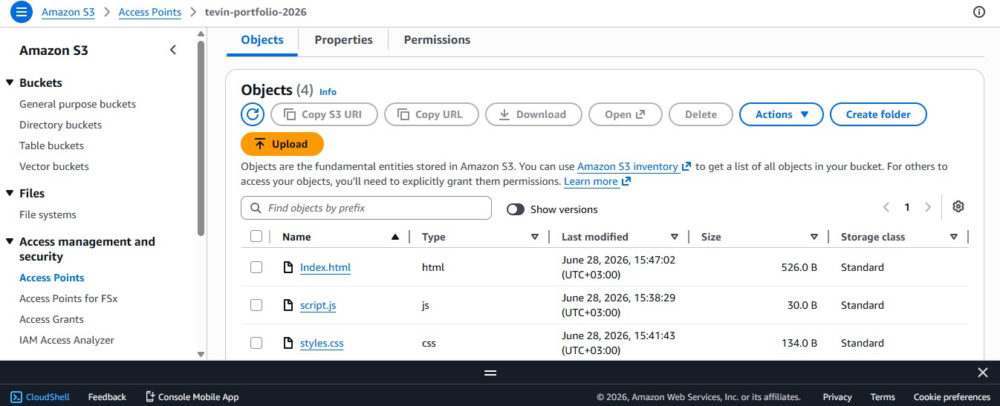
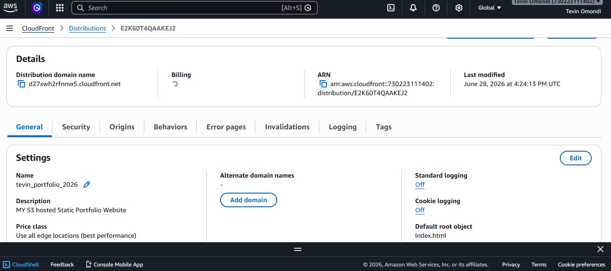
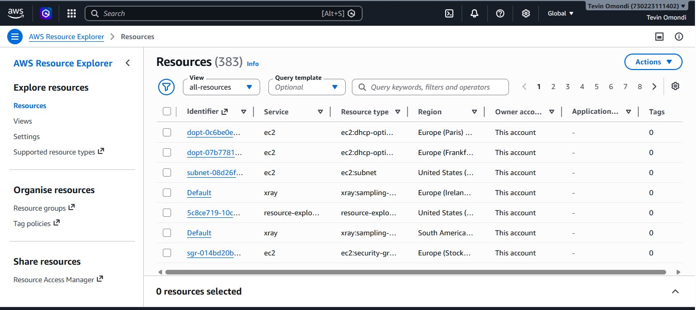
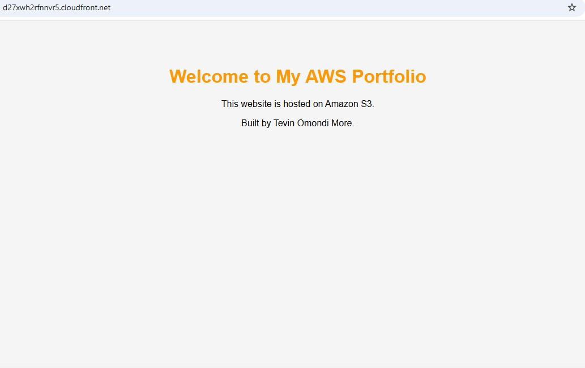

<<<<<<< HEAD
# AWS S3 Static Website with CloudFront using Terraform

# 🌐 AWS S3 Static Website with CloudFront using Terraform


## Project Overview

This project provisions a secure static website on AWS using Terraform.

Infrastructure is deployed as code and includes:

- Amazon S3
- Amazon CloudFront
- Origin Access Control (OAC)
- Bucket Policy
- S3 Versioning
- Server-side Encryption
- Website file uploads

---

## Architecture

```
Internet
      │
      ▼
CloudFront
      │
      ▼
Origin Access Control (OAC)
      │
      ▼
Private S3 Bucket
```

---

## Technologies Used

- Terraform
- AWS S3
- AWS CloudFront
- AWS IAM
- AWS CLI
- Git
- GitHub

---

## Deployment

```bash
terraform init
terraform plan
terraform apply
```

---

## CloudFront Distribution

- CloudFront URL: d62pv7v6kxgpy.cloudfront.net

  ## S3 Bucket
- S3 Bucket Name: tevin-portfolio-2026-tf

<p align="center">
  
  
</p>

---

## Screenshots

### Terraform Apply

<p align="center">

</p>

### AWS Resources

<p align="center">

</p>

## Website
<p align="center">

</p>
---

## Lessons Learned

- Infrastructure as Code (IaC)
- Secure S3 configuration
- CloudFront Origin Access Control
- Bucket Policies
- Terraform state management

---

## Author

**Tevin Omondi**

Aspiring Cloud Architect | AWS | Terraform | DevOps
=======
# terraform-s3-cloudfront-static-website
>>>>>>> 7e567213601616e6d2c024e09f602c2306fad846
